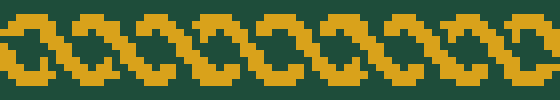
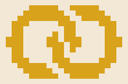
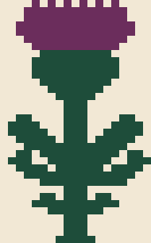
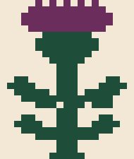
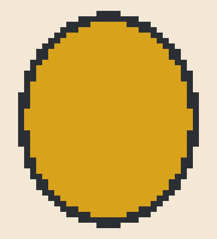
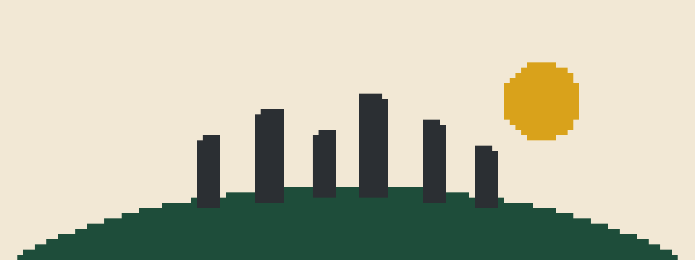
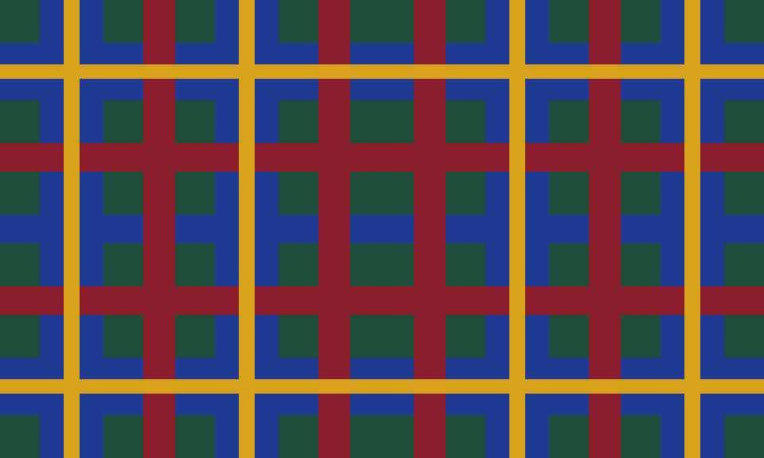

# Motif catalog

All functions take explicit palette indices and sizes in inches (cells via `gr.cols/gr.rows`).
Thumbnails are rendered at sc gauge, 10 px per stitch, by `graphghan catalog`.

| motif | call | use it for | notes |
|---|---|---|---|
|  twist strip | `motifs.twist.twist_strip_in(length, thick, horizontal, period_in=4.0, amp_in=1.0, radius_in=0.3, bg, fg, fit=True)` | braided border strips | inch-true; crossings every 2 in; fitted so a crossing lands on both corners; use through `frame.twist_frame` |
|  Solomon's knot | `motifs.knots.corner_block(w, h, bg, fg, outline=2)` | corner blocks ≥ 6 in | two interlaced stadium rings; blurs at hdc |
|  woven X | `motifs.knots.woven_x_block(w, h, bg, fg, outline=2, bar_in=0.6)` | saltire corners | reads at any gauge |
|  rings | `motifs.rings.rings(bg, fg, r_in=1.1, r_out=1.75, gap_in=1.9)` | wedding rings on a panel | 2 crossings, left ring over at top |
|  thistle | `motifs.thistle.thistle(bg, head, leaf)` | 8.5 in tall thistle (19 × 34 cells at sc) | hand-drawn; scale only via `thistle_scaled` |
|  thistle, compact | `motifs.thistle.thistle_small(bg, head, leaf)` | ≤ 6.5 in thistles | native small drawing; `thistle_scaled` picks it under 7 in |
|  bloom icon | `motifs.thistle.bloom_icon(bg, head, calyx)` | a thistle in each link of a linked band | 4 × 4 cells at sc |
|  dragonfly | `motifs.dragonfly.dragonfly(w, h, bg, body, wing_fill, wing_line, span=7.0)` | dragonfly silhouettes/outlines | solid wings (`wing_fill == wing_line`) read best under 6 in |
|  amber drop | `motifs.dragonfly.amber_drop(w, h, bg, fill, line, a=4.3, b=4.9, edge=0.42)` | the "dragonfly in amber" emblem | blit the dragonfly onto it with `bg` = the drop's fill |
|  standing stones | `motifs.stones.standing_stones(w, h, bg, hill, stone, moon)` | Craigh na Dun scene across a panel | moon placed clear of stones; needs ≥ 9 in height |
|  plaid | `motifs.plaid.plaid(w, h, phase_x, phase_y, colors={"G","B","Y","R"}, sett, priority)` | tartan-colored frames | priority rule, min 2-stitch stripes; busy: ~40 changes per full row |
|  stripe band | `motifs.bands.stripe_band(length, thick, seq, horizontal)` | zero-change frame bands | seq = [(color, cells), …] |

Frames (`graphghan.frame`): `twist_frame(g, W, H, bg, fg, edge_in=0.5, strip_in=3.5, corners="dot"|"solid"|"cross", margin_in=0.75)`
and `link_frame(g, W, H, ground, rail, bloom, calyx, edge_color, ...)`; both return the panel rect.
Lettering: `compose.text_block(g, lines, x_center, y_top, size_rows, pitch_rows, font_path, color, bg)`.
